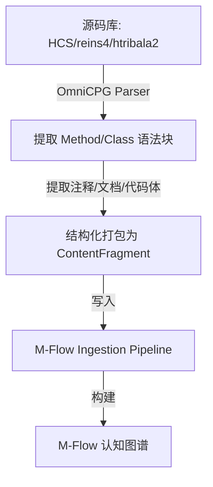

# M-Flow & OmniCPG 双图协同架构提案：认知记忆与代码图谱的深度融合

为了解决**业务规则、开发决策（M-Flow 认知记忆）**与**源码结构、程序逻辑（OmniCPG 代码图谱）**之间割裂的痛点，本提案针对华泰再保项目，提出了一套将 M-Flow 与 OmniCPG 结合使用的双图协同架构方案。

---

## 1. 核心融合价值：为什么需要双图协同？

华泰再保系统具有复杂的业务规则（如比例/非比例、PML 规则、推送时序）和庞大的代码体量（307 万个 CPG 节点）。
- **M-Flow（认知记忆图谱）**：擅长理解“Why”（为什么这么做、业务逻辑是什么、开发决策历史）。但它对源码是“瞎子”，无法精确定位某行代码或调用链路。
- **OmniCPG（代码属性图谱）**：擅长分析“How & Where”（代码怎么写、调用链怎么走、数据如何传递）。但它对业务是“聋子”，无法理解代码背后的需求背景和设计意图。

**双图协同（Concept-to-Code）** 能够把两者的优势结合起来，构建起从 **“业务需求 ➜ 系统架构 ➜ 源码实现 ➜ 数据流向”** 的全链路可追溯认知空间。

```
                    ┌──────────────────────────────────────┐
                    │          M-Flow 认知记忆图谱          │
                    │   (Episode · Facet · Business Entity)│
                    └──────────────────┬───────────────────┘
                                       │
                                       │ 关联映射 (Concept-to-Code)
                                       │
                    ┌──────────────────▼───────────────────┐
                    │         OmniCPG 代码属性图谱         │
                    │   (Method · Class · CallSite · DFG)  │
                    └──────────────────────────────────────┘
```

---

## 2. 结合使用场景设计

### 场景一：概念至代码的语义关联（Concept-to-Code Mapping）

#### 💡 设计方案
在 M-Flow 的 `Entity`（实体）模型中，将代码中的关键标识符（如类名 `GuProposalServiceImpl`、方法名 `settleGuReinsCeded`、表名 `GuProposalReinsCeded`）也建模为代码类型的 Entity，并与业务概念类型的 Entity 建立链接关系。

#### 🔗 关系建模
1. **M-Flow 内部链接**：
   - `[Episode: 再保投保确认逻辑]` ➜ (has_facet) ➜ `[Facet: 份额计算与持久化]`
   - `[Facet: 份额计算与持久化]` ➜ (involves_entity) ➜ `[Entity: PML保额计算规则]`（业务概念）
   - `[Entity: PML保额计算规则]` ➜ **`[Edge: IMPLEMENTED_BY]`** ➜ `[Entity: PlyEdrReinsShare.java]`（代码实体）
2. **跨项目映射属性**：
   在代码实体的 `metadata` 中，记录其在 OmniCPG 中的唯一 `node_id`、`project_id`（如 `HCS`、`reins4`）以及 `file_path`。

#### 🎯 运行效果
当开发智能体被问及 *"华泰再保中 PML 份额怎么计算，在代码中哪里实现的？"* 时：
1. M-Flow 召回业务文档和 Episode，输出 PML 的计算公式（解决 Why）。
2. M-Flow 通过 `IMPLEMENTED_BY` 边定位到对应的代码 Entity，并获取 OmniCPG 的 `node_id`。
3. 智能体无缝调用 OmniCPG MCP 工具（如 `analyze_function`），将具体的 Java 源码展示给用户（解决 Where）。

---

### 场景二：基于语法单元的“结构化代码摄入”（Syntax-Aware Code Ingestion）

#### 💡 设计方案
目前 M-Flow 只能将源码文件当做纯文本进行滑动窗口切片（Line-based Chunking），这会切断方法、类定义的完整性，导致向量检索和 BM25 检索噪音大。利用 OmniCPG 的静态分析能力，作为 M-Flow 的**代码解析前置机**。



#### 🛠️ 实施步骤
1. OmniCPG 对目标项目运行分析，将 Class 和 Method 节点过滤出来。
2. 提取每个 Method 的完整代码段（`code` 属性）、方法签名（`name`）、以及关联的 JavaDoc / Inline 注释。
3. 将这些完整的语法单元作为 `ContentFragment` 导入 M-Flow。
4. M-Flow 对其建立精准的向量与 BM25 稀疏索引。

#### 🎯 运行效果
由于索引是基于完整的方法/类边界建立的，当检索如 `settleGuReinsCeded` 等特定类方法时，召回的 Content Fragment 保持完美的语法完整性，不会出现上下文缺失或拼凑感。

---

### 场景三：双图联合的“全局-局部”混合推理（Hybrid Agent Reasoning）

#### 💡 设计方案
当 AI 智能体（Cursor / Windsurf / Claude Desktop）执行复杂的逆向分析或 Bug 定位任务时，同时挂载 M-Flow 和 OmniCPG 的 MCP 服务，执行“双图联合推理”。

```
   ┌────────────────────────────────────────────────────────┐
   │                  AI Agent 推理工作流                    │
   └──────────────────────────┬─────────────────────────────┘
                              │
             1. 检索业务背景与时序规程 │ 2. 定位源码入口与调用拓扑
             ┌────────────────▼───────────────┐
             │         M-Flow MCP             │
             │   - 召回业务规范, 推送校验时序   │
             │   - 锁定涉及的业务模块和核心类名  │
             └────────────────┬───────────────┘
                              │
             3. 映射为代码实体并传递 node_id / class_name
             ┌────────────────▼───────────────┐
             │        OmniCPG MCP             │
             │   - 进行数据流切片 (find_data_flow)│
             │   - 追踪跨系统调用 (get_call_graph)│
             └────────────────┬───────────────┘
                              │
                              ▼
             ┌────────────────────────────────┐
             │       最终生成：逆向分析报告    │
             │     (Why 业务动因 + How 源码流向)│
             └────────────────────────────────┘
```

#### 🎯 典型工作流示例（以“HCS 推送 reins4 失败定位”为例）
1. **第一步（M-Flow）**：查询 `HtInterFaceServiceImpl` 的推送顺序。M-Flow 检索到 Procedural Memory（过程记忆），指出推送必须严格遵循 `PL ➜ ES ➜ RRPN ➜ RREN` 顺序（解决时序逻辑）。
2. **第二步（OmniCPG）**：使用 `query_nodes` 查询 `HtInterFaceServiceImpl` 的 `checkPush` 方法。
3. **第三步（OmniCPG）**：调用 `find_control_flow` 追踪 `checkPush` 中的校验分支，查看是否由于某张表的推送状态标志未满足而拦截了后续推送。
4. **最终输出**：结合 M-Flow 里的“为什么有这个时序规则”（防重防乱序）与 OmniCPG 里的“代码怎么实现这一校验”（控制流分支），生成高准确度的逆向诊断报告。

---

### 场景四：基于 M-Flow 的代码图谱语义富集（Semantic Enrichment via M-Flow）

#### 💡 设计方案
OmniCPG 的 Schema（`REQ-SCHEMA-002`）中预留了 `semantic_summary`（自然语言语义和意图总结）和 `embedding`（向量表示）属性。我们可以通过 M-Flow 的 LLM 和向量组件，对 OmniCPG 中的核心方法进行**语义化富集**。

#### 🛠️ 实施步骤
1. 扫描 OmniCPG 中入度/出度较高的核心方法节点。
2. 将方法源码及关联的 AST 邻居节点信息作为输入，调用 M-Flow 的大模型组件生成“自然语言意图总结”。
3. 调用 M-Flow 配置的 Embedding 接口（如 GPUStack 上的 `bge-m3`），生成 1024 维的向量。
4. 将总结和向量写回 Neo4j 对应的节点属性中。

#### 🎯 运行效果
富集后，Neo4j 代码图谱具备了直接接受自然语言检索（Semantic Search）的能力。即便查询词不是精确的代码符号，也能通过向量匹配定位到具体的 `Method` 节点。

---

## 3. 下一步实施建议（Action Plan）

> [!TIP]
> 建议采用**渐进式融合**路线，先打通查询链路，再逐步实现自动化图关联与富集。

### 阶段一：建立双向 MCP 检索客户端（低成本，高收益）
编写一个轻量级的桥接脚本或 Agent System Prompt，指示智能体在分析华泰再保系统时：
- 遇到术语和业务流程问题，优先查询 `m-flow` 获取 Episode/Procedure；
- 遇到方法定义、数据流流向和具体类调用，调用 `omnicpg` MCP 获取代码结构信息。

### 阶段二：编写 Concept-to-Code 映射生成脚本
- 开发一个解析脚本，在 M-Flow 执行文档和代码摄入时，识别文中的代码标识符（如 `GuProposalReinsCeded`）。
- 自动在 KuzuDB (M-Flow) 中创建该代码 Entity，并通过 `same_entity_as` 或 `IMPLEMENTS` 链接到对应的业务术语。

### 阶段三：基于 CPG 结构化摄入优化 M-Flow 检索质量
- 修改现有的 `ingest_to_mflow.py`，增加代码摄入分支。当遇到 Python/Java 代码时，先调 OmniCPG 生成 CPG，再抽取方法级语法块写入 M-Flow 向量库，替代原有的文本切片，彻底消除代码检索碎片化的问题。
